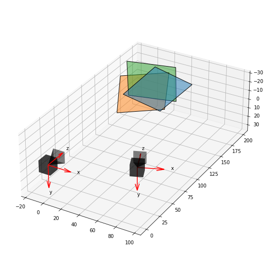
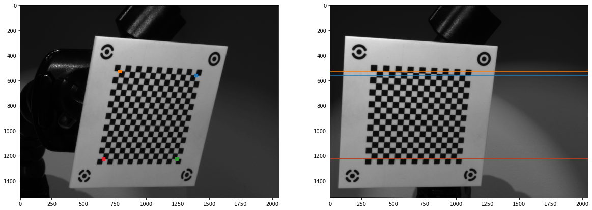

```python
# default_exp image_rect
```

# Image Rectification


```python
# export
import PIL
import torch
from camera_calib.utils import *
```


```python
import re
from pathlib import Path

import camera_calib.api as api
import matplotlib.pyplot as plt
import scipy
from camera_calib.modules import Inverse, Rigids
from camera_calib.plot import plot_extrinsics
from camera_calib.utils import *
```

# Utility


```python
# export
def save_16bit(arr, file_img):
    pim = PIL.Image.fromarray((torch2np(arr)*(2**16-1)).astype(np.uint16), mode='I;16')
    pim.save(file_img)    
```


```python
# export
def distort_coords(ps_p, cam, distort):
    p2pd = torch.nn.Sequential(Inverse(cam), distort, cam)
    return p2pd(ps_p)
```


```python
# export
def undistort_array(arr, cam, distort, **kwargs):
    return interp_array(arr, distort_coords(array_ps(arr), cam, distort), **kwargs).reshape(arr.shape)
```

# Rectify


```python
dir_imgs = Path('data/dot_vision_checker')
```


```python
def _parse_name(name_img):
    match = re.match(r'''SERIAL_(?P<serial>.*)_
                         DATETIME_(?P<date>.*)_
                         CAM_(?P<cam>.*)_
                         FRAMEID_(?P<frameid>.*)_
                         COUNTER_(?P<counter>.*).png''', 
                     name_img, 
                     re.VERBOSE)
    return match.groupdict()
```


```python
imgs = []
for file_img in dir_imgs.glob('*.png'):
    dict_group = _parse_name(file_img.name)
    img = api.File16bitImg(file_img)
    img.idx_cam = int(dict_group['cam'])-1
    img.idx_cb  = int(dict_group['counter'])-1
    imgs.append(img)
```


```python
for img in imgs: print(f'{img.name} - cam: {img.idx_cam} - cb: {img.idx_cb}')
```

    SERIAL_16276941_DATETIME_2019-06-07-00:38:48-109732_CAM_2_FRAMEID_0_COUNTER_2 - cam: 1 - cb: 1
    SERIAL_19061245_DATETIME_2019-06-07-00:38:19-438594_CAM_1_FRAMEID_0_COUNTER_1 - cam: 0 - cb: 0
    SERIAL_16276941_DATETIME_2019-06-07-00:39:19-778185_CAM_2_FRAMEID_0_COUNTER_3 - cam: 1 - cb: 2
    SERIAL_16276941_DATETIME_2019-06-07-00:38:19-438631_CAM_2_FRAMEID_0_COUNTER_1 - cam: 1 - cb: 0
    SERIAL_19061245_DATETIME_2019-06-07-00:39:19-778134_CAM_1_FRAMEID_0_COUNTER_3 - cam: 0 - cb: 2
    SERIAL_19061245_DATETIME_2019-06-07-00:38:48-109705_CAM_1_FRAMEID_0_COUNTER_2 - cam: 0 - cb: 1


## Calibrate

Do a simple calibration


```python
h_cb = 50.8
w_cb = 50.8
h_f = 42.672
w_f = 42.672
num_c_h = 16
num_c_w = 16
spacing_c = 2.032
cb_geom = api.CbGeom(h_cb, w_cb,
                     api.CpCSRGrid(num_c_h, num_c_w, spacing_c),
                     api.FmCFPGrid(h_f, w_f))
```


```python
file_model = Path('models/dot_vision_checker.pth')
detector = api.DotVisionCheckerDLDetector(file_model)
```


```python
refiner = api.OpenCVCheckerRefiner(hw_min=5, hw_max=15, cutoff_it=20, cutoff_norm=1e-3)
```


```python
calib = api.multi_calib(imgs, cb_geom, detector, refiner)
```

    Refining control points for: SERIAL_19061245_DATETIME_2019-06-07-00:38:19-438594_CAM_1_FRAMEID_0_COUNTER_1...
    Refining control points for: SERIAL_19061245_DATETIME_2019-06-07-00:39:19-778134_CAM_1_FRAMEID_0_COUNTER_3...
    Refining control points for: SERIAL_19061245_DATETIME_2019-06-07-00:38:48-109705_CAM_1_FRAMEID_0_COUNTER_2...
    Refining single parameters...
     - Iteration: 000 - Norm:    0.02117 - Loss:   64.08690
     - Iteration: 001 - Norm:    0.03960 - Loss:   58.11754
     - Iteration: 002 - Norm:    0.47925 - Loss:   11.09834
     - Iteration: 003 - Norm:    0.17388 - Loss:    7.19586
     - Iteration: 004 - Norm:    0.07121 - Loss:    6.74723
     - Iteration: 005 - Norm:    2.31742 - Loss:    6.59264
     - Iteration: 006 - Norm:    3.20527 - Loss:    6.44872
     - Iteration: 007 - Norm:   34.39009 - Loss:    4.86668
     - Iteration: 008 - Norm:    0.00000 - Loss:    4.86668
    Refining control points for: SERIAL_16276941_DATETIME_2019-06-07-00:38:48-109732_CAM_2_FRAMEID_0_COUNTER_2...
    Refining control points for: SERIAL_16276941_DATETIME_2019-06-07-00:39:19-778185_CAM_2_FRAMEID_0_COUNTER_3...
    Refining control points for: SERIAL_16276941_DATETIME_2019-06-07-00:38:19-438631_CAM_2_FRAMEID_0_COUNTER_1...
    Refining single parameters...
     - Iteration: 000 - Norm:    0.04097 - Loss:  179.67769
     - Iteration: 001 - Norm:    0.12849 - Loss:  112.14013
     - Iteration: 002 - Norm:    0.58911 - Loss:   31.40931
     - Iteration: 003 - Norm:    0.37932 - Loss:    6.19159
     - Iteration: 004 - Norm:    0.19770 - Loss:    6.09586
     - Iteration: 005 - Norm:   30.72789 - Loss:    4.46654
     - Iteration: 006 - Norm:    2.63332 - Loss:    4.28983
     - Iteration: 007 - Norm:    0.00000 - Loss:    4.28983
    Refining multi parameters...
     - Iteration: 000 - Norm:    0.00099 - Loss:   31.31317
     - Iteration: 001 - Norm:    0.00384 - Loss:   24.25675
     - Iteration: 002 - Norm:    0.00405 - Loss:   19.39406
     - Iteration: 003 - Norm:    0.00586 - Loss:   17.16208
     - Iteration: 004 - Norm:    0.00608 - Loss:   15.65026
     - Iteration: 005 - Norm:    0.00271 - Loss:   15.15424
     - Iteration: 006 - Norm:    0.01001 - Loss:   14.03451
     - Iteration: 007 - Norm:    0.00075 - Loss:   13.91239
     - Iteration: 008 - Norm:    0.00032 - Loss:   13.90795
     - Iteration: 009 - Norm:    0.00516 - Loss:   13.85823
     - Iteration: 010 - Norm:    0.00545 - Loss:   13.83085
     - Iteration: 011 - Norm:    0.03479 - Loss:   13.66085
     - Iteration: 012 - Norm:    0.00280 - Loss:   13.65038
     - Iteration: 013 - Norm:    0.03373 - Loss:   13.49903
     - Iteration: 014 - Norm:    0.00994 - Loss:   13.45923
     - Iteration: 015 - Norm:    0.00458 - Loss:   13.45677
     - Iteration: 016 - Norm:    0.00000 - Loss:   13.45677
     - Iteration: 017 - Norm:    0.00000 - Loss:   13.45677


```python
api.plot_residuals(calib);
```


```python
api.plot_extrinsics(calib);
```





```python
api.save(calib, 'data/calib.pth')
```

Freeze above and just load


```python
calib = api.load('data/calib.pth')
```

Parse stuff out


```python
cam1,       cam2       = calib['cams'][0],       calib['cams'][1]
distort1,   distort2   = calib['distorts'][0],   calib['distorts'][1]
rigid_cam1, rigid_cam2 = calib['rigids_cam'][0], calib['rigids_cam'][1]
```

## Essential and Fundamental matrices

Normally you would need normalized points (i.e. knowledge of camera matrices) to get the essential matrix, but if you know relative pose via camera calibration, you can compute it directly.


```python
# export
def get_essential(R12, t12): return cross_mat(t12)@R12
```

Fundamental matrix only need pixel points, but is also calculable from camera calibration. 


```python
# export
@numpyify
def get_fundamental(R12, t12, A1, A2):
    E = get_essential(R12, t12)
    return torch.inverse(A2.T)@E@torch.inverse(A1)
```

Get two example images


```python
idx_cb = 1
```


```python
[img1] = [img for img in imgs if img.idx_cb == idx_cb and img.idx_cam == 0]
[img2] = [img for img in imgs if img.idx_cb == idx_cb and img.idx_cam == 1]
img1, img2
```


    (File16bitImg(SERIAL_19061245_DATETIME_2019-06-07-00:38:48-109705_CAM_1_FRAMEID_0_COUNTER_2),
     File16bitImg(SERIAL_16276941_DATETIME_2019-06-07-00:38:48-109732_CAM_2_FRAMEID_0_COUNTER_2))


Load distorted arrays


```python
arr1_d = img1.array_gs(torch.double)
arr2_d = img2.array_gs(torch.double)
```

Undistort arrays first


```python
with torch.no_grad():
    arr1_u = undistort_array(arr1_d, cam1, distort1)
    arr2_u = undistort_array(arr2_d, cam2, distort2)
```

I've already computed some corresponding points in undistorted coordinates


```python
ps1_u = torch.DoubleTensor([[1302.6686,  589.8210],
                            [ 836.5483,  544.9905],
                            [1189.6493, 1161.7684],
                            [ 723.1662, 1187.0083]])
ps2_u = torch.DoubleTensor([[1072.0118,  565.5825],
                            [ 366.8702,  528.9731],
                            [1001.8763, 1227.6773],
                            [ 322.3230, 1235.3946]])
```


```python
idx = 3
p1_u = ps1_u[idx]
p2_u = ps2_u[idx]
```


```python
_, axs = plt.subplots(1, 2, figsize=(20,20))
for ax, arr_u, p_u in zip(axs, [arr1_u, arr2_u], [p1_u, p2_u]):
    ax.imshow(arr_u, cmap='gray')
    ax.plot(p_u[0], p_u[1], 'rs')
```


Get rigid transform of camera 1 WRT camera 2


```python
M12 = Rigids([rigid_cam1, Inverse(rigid_cam2)]).get_param()
R12, t12 = M2Rt(M12)
R12, t12
```


    (tensor([[ 9.2331e-01,  3.7136e-03,  3.8403e-01],
             [-3.1065e-03,  9.9999e-01, -2.2013e-03],
             [-3.8403e-01,  8.3953e-04,  9.2332e-01]], dtype=torch.float64),
     tensor([-8.3587e+01,  6.6860e-02, -6.9031e+00], dtype=torch.float64))


```python
A1 = cam1.get_param()
A2 = cam2.get_param()
A1, A2
```


    (tensor([[3.6029e+03, 0.0000e+00, 9.9590e+02],
             [0.0000e+00, 3.6029e+03, 7.7632e+02],
             [0.0000e+00, 0.0000e+00, 1.0000e+00]], dtype=torch.float64),
     tensor([[3.5914e+03, 0.0000e+00, 1.0454e+03],
             [0.0000e+00, 3.5914e+03, 7.9239e+02],
             [0.0000e+00, 0.0000e+00, 1.0000e+00]], dtype=torch.float64))


```python
F = get_fundamental(R12, t12, A1, A2)
F
```


    tensor([[-3.6417e-09,  5.3350e-07, -3.9758e-04],
            [-2.9734e-06,  3.4421e-09,  2.3710e-02],
            [ 2.4148e-03, -2.3760e-02, -2.5805e-01]], dtype=torch.float64)


Check if these points satisfy constraint


```python
augment(p2_u).T@F@augment(p1_u)
```


    tensor(-7.8241e-07, dtype=torch.float64)


Appears close to zero... Lets try to plot epipolar lines


```python
def plot_epi(ps1, F, arr1, arr2):
    fig, axs = plt.subplots(1, 2, figsize=(20,20))
    for arr, ax in zip([arr1, arr2], axs): ax.imshow(arr, cmap='gray')
    bb_arr2 = array_bb(arr2)    
    cs = get_colors(len(ps1))
    for p1, c in zip(ps1, cs):
        l2 = F@augment(p1)
        ps2_epi = bb_l_intersect(bb_arr2, l2)
        axs[0].plot(p1[0], p1[1], marker='s', c=c)
        axs[1].plot(ps2_epi[:, 0], ps2_epi[:, 1], c=c)
```


```python
plot_epi(ps1_u, F, arr1_u, arr2_u)
```


Epipolar lines look to intersect the same points on the right image

Quick check to see if nullspace of fundamental matrix is the same as the epipole


```python
e = scipy.linalg.null_space(F)
e /= e[-1]
e
```


    array([[7.97506373e+03],
           [7.99672254e+02],
           [1.00000000e+00]])


```python
e = -R12.T@t12 # Transform origin of second camera
e = e/e[-1]    # Normalize
e = A1@e       # Apply camera matrix
e
```


    tensor([7.9751e+03, 7.9967e+02, 1.0000e+00], dtype=torch.float64)


## Fusiello Rectification

This method is easier to understand and implement, so lets try it first.


```python
# export
@numpyify
def rigid_rect_fusi(M1, M2):
    R1, t1 = M2Rt(M1)
    _,  t2 = M2Rt(M2)
    
    # Get rotation matrix
    r1 = t2-t1                     # new x-axis should be parallel to t1->t2 after rotation
    r2 = torch.cross(R1[:, 2], r1) # new y-axis is orthogonal to camera 1's old z axis and new x-axis
    r3 = torch.cross(r1, r2)       # new z-axis is orthogonal to new x and y axes
    r1, r2, r3 = unitize(stackify((r1, r2, r3)))
    R_r = stackify((r1, r2, r3), dim=1)
        
    return Rt2M(R_r, t1), Rt2M(R_r, t2)
```


```python
M1 = rigid_cam1.get_param()
M2 = rigid_cam2.get_param()
```


```python
M1_r, M2_r = rigid_rect_fusi(M1, M2)
M1_r, M2_r
```


    (tensor([[ 0.8886, -0.0033, -0.4587,  0.0000],
             [ 0.0030,  1.0000, -0.0015,  0.0000],
             [ 0.4587,  0.0000,  0.8886,  0.0000],
             [ 0.0000,  0.0000,  0.0000,  1.0000]], dtype=torch.float64),
     tensor([[ 8.8858e-01, -3.3457e-03, -4.5872e-01,  7.4526e+01],
             [ 2.9730e-03,  9.9999e-01, -1.5348e-03,  2.4935e-01],
             [ 4.5872e-01,  0.0000e+00,  8.8858e-01,  3.8474e+01],
             [ 0.0000e+00,  0.0000e+00,  0.0000e+00,  1.0000e+00]],
            dtype=torch.float64))


One good check is to rectify twice, which should return the same inputs


```python
assert_allclose(rigid_rect_fusi(M1_r, M2_r), (M1_r, M2_r))
```

Get rectified camera matrices


```python
# export
def cam_rect_fusi(A1, A2):
    A_r = (A1 + A2)/2
    return A_r, A_r
```


```python
A1_r, A2_r = cam_rect_fusi(A1, A2)
A1_r, A2_r
```


    (tensor([[3.5971e+03, 0.0000e+00, 1.0207e+03],
             [0.0000e+00, 3.5971e+03, 7.8436e+02],
             [0.0000e+00, 0.0000e+00, 1.0000e+00]], dtype=torch.float64),
     tensor([[3.5971e+03, 0.0000e+00, 1.0207e+03],
             [0.0000e+00, 3.5971e+03, 7.8436e+02],
             [0.0000e+00, 0.0000e+00, 1.0000e+00]], dtype=torch.float64))


Get rectifying homographies


```python
# export
@numpyify
def rect_homography(A, M, A_r, M_r):
    (R, t), (R_r, t_r) = map(M2Rt, [M, M_r])
    assert_allclose(t, t_r) # There can be no change in translation for rectification; only rotation
    return A@R.T@R_r@torch.inverse(A_r)
```


```python
H1 = rect_homography(A1, M1, A1_r, M1_r)
H2 = rect_homography(A2, M2, A2_r, M2_r)
```

Rectify images


```python
# export
def rect_array(arr_d, H, cam, distort):
    ps_pr = array_ps(arr_d)                                 # Get rectified pixel coordinates
    ps_p  = pmm(ps_pr, H, aug=True)                         # Get pixel coordinates
    ps_pd = distort_coords(ps_p, cam, distort)              # Get distorted coordinates
    arr_r = interp_array(arr_d, ps_pd).reshape(arr_d.shape) # Rectify and undistort image
    return arr_r
```


```python
with torch.no_grad():
    arr1_r = rect_array(arr1_d, H1, cam1, distort1)
    arr2_r = rect_array(arr2_d, H2, cam2, distort2)
```


```python
fig, axs = plt.subplots(2, 2, figsize=(20,15))
axs[0,0].imshow(arr1_d, cmap='gray')
axs[0,1].imshow(arr2_d, cmap='gray')
axs[1,0].imshow(arr1_r, cmap='gray')
axs[1,1].imshow(arr2_r, cmap='gray');
```


To see why the left image is mostly out of FOV, we plot the extrinsics:


```python
fig = plt.figure(figsize=(20,15))

ax = fig.add_subplot(1, 2, 1, projection='3d')
plot_extrinsics([rigid_cb.get_param() for rigid_cb in calib['rigids_cb']], 
                [M1, M2],
                calib['cb_geom'], 
                ax=ax)
ax.view_init(elev=90, azim=-90)

ax = fig.add_subplot(1, 2, 2, projection='3d')
plot_extrinsics([rigid_cb.get_param() for rigid_cb in calib['rigids_cb']], 
                [M1_r, M2_r],
                calib['cb_geom'],
                ax=ax)
ax.view_init(elev=90, azim=-90)
```


The left camera rotates so much that the image goes out of FOV. You can actually fix this by adjusting the camera matrix, but that wasn't included in Fusiello's original paper. I actually like Bouguet's method better though, so we'll do that first.

## Bouguet Rectification

### Rigid Rectification

Bouguet's method aligns cameras by taking mid point rotation (via rodrigues parameterization), then it aligns it by doing shortest rotation to lines formed by principle points.


```python
# export
@numpyify
def rigid_rect_boug(M1, M2):
    R1, t1 = M2Rt(M1)
    _,  t2 = M2Rt(M2)
    
    # First, get mid-point rotation so both cameras are aligned
    R12, t12 = M2Rt(invert_rigid(M2)@M1)
    r12 = R2rodrigues(R12)
    R12_half = rodrigues2R(r12/2)
    
    # Next, get rotation so both cameras are aligned to p1->p2
    Rx = v_v_R(R12_half.T@t12, M1.new_tensor([-1, 0, 0]))
    
    # Compose to get rectified rotations
    # Note that: 
    #     R_r = R2@R12_half@Rx.T
    # As well
    R_r = R1@R12_half.T@Rx.T
        
    return Rt2M(R_r, t1), Rt2M(R_r, t2)
```


```python
M1_r, M2_r = rigid_rect_boug(M1, M2)
M1_r, M2_r
```


    (tensor([[ 8.8858e-01, -2.6739e-03, -4.5872e-01,  0.0000e+00],
             [ 2.9730e-03,  1.0000e+00, -7.0170e-05,  0.0000e+00],
             [ 4.5872e-01, -1.3014e-03,  8.8858e-01,  0.0000e+00],
             [ 0.0000e+00,  0.0000e+00,  0.0000e+00,  1.0000e+00]],
            dtype=torch.float64),
     tensor([[ 8.8858e-01, -2.6739e-03, -4.5872e-01,  7.4526e+01],
             [ 2.9730e-03,  1.0000e+00, -7.0170e-05,  2.4935e-01],
             [ 4.5872e-01, -1.3014e-03,  8.8858e-01,  3.8474e+01],
             [ 0.0000e+00,  0.0000e+00,  0.0000e+00,  1.0000e+00]],
            dtype=torch.float64))


One good check is to rectify twice, which should return the same inputs


```python
assert_allclose(rigid_rect_boug(M1_r, M2_r), (M1_r, M2_r))
```

Get rectified camera matricies


```python
A1_r, A2_r = cam_rect_fusi(A1, A2)
```

Rectify images


```python
H1 = rect_homography(A1, M1, A1_r, M1_r)
H2 = rect_homography(A2, M2, A2_r, M2_r)
```


```python
with torch.no_grad():
    arr1_r = rect_array(arr1_d, H1, cam1, distort1)
    arr2_r = rect_array(arr2_d, H2, cam2, distort2)
```


```python
fig, axs = plt.subplots(2, 2, figsize=(20,15))
axs[0,0].imshow(arr1_d, cmap='gray')
axs[0,1].imshow(arr2_d, cmap='gray')
axs[1,0].imshow(arr1_r, cmap='gray')
axs[1,1].imshow(arr2_r, cmap='gray');
```


First image is still out of FOV, but the second image is better aligned in Bouguet's method, which makes sense because Fusiello's method only takes the rotation of the first camera into account.

### Camera Rectification

For rectification, in terms of extrinsics, you can only rotate the cameras. This alone may cause problems if one of the cameras rotates a lot. To fix this issue, you can also modify the intrinsics (camera matrices), but they must have the following constraints:

* Focal points should be the same to ensure epipolar lines are "spaced the same"
* The y component of the principle point should be the same to ensure the lines are collinear
* The x component can be different

As long as we follow the above, the epipolar lines will be horizontal and aligned.


```python
# export
@numpyify
def cam_rect_boug(A1, A2, M1, M2, M1_r, M2_r, sz):
    zero = A1.new_tensor(0)
    
    (R1, _), (R1_r, _) = M2Rt(M1), M2Rt(M1_r)
    (R2, _), (R2_r, _) = M2Rt(M2), M2Rt(M2_r)
    
    # Get focal length
    alpha = stackify((A1[[0,1],[0,1]], A2[[0,1],[0,1]])).mean()
    A_alpha = stackify(((alpha, zero),
                        (zero,  alpha)))
    
    # Get new principle points such that center of image gets mapped close to rectified center
    def _get_po_pr(A, R, R_r):
        po_nr = pmm(po_p, R_r.T@R@torch.inverse(A), aug=True)
        po_pr = po_p - pmm(A_alpha, po_nr)
        return po_pr
    po_p = (sz[[1,0]]-1)/2  
    po_pr1, po_pr2 = _get_po_pr(A1, R1, R1_r), _get_po_pr(A2, R2, R2_r)
    xo_r1, xo_r2 = po_pr1[0], po_pr2[0]
    yo_r = (po_pr1[1]+po_pr2[1])/2
    
    # Create camera matrices
    def _get_A(xo_r):
        return torch.cat([torch.cat([A_alpha, stackify((((xo_r,), (yo_r,))))], dim=1), 
                          A1.new_tensor([[0, 0, 1]])])
    return _get_A(xo_r1), _get_A(xo_r2)
```


```python
A1_r, A2_r = cam_rect_boug(A1, A2, M1, M2, M1_r, M2_r, shape(arr1_d))
A1_r, A2_r
```


    (tensor([[ 3.5971e+03,  0.0000e+00, -8.6848e+02],
             [ 0.0000e+00,  3.5971e+03,  7.8647e+02],
             [ 0.0000e+00,  0.0000e+00,  1.0000e+00]], dtype=torch.float64),
     tensor([[3.5971e+03, 0.0000e+00, 7.4850e+02],
             [0.0000e+00, 3.5971e+03, 7.8647e+02],
             [0.0000e+00, 0.0000e+00, 1.0000e+00]], dtype=torch.float64))


Rectify images


```python
H1 = rect_homography(A1, M1, A1_r, M1_r)
H2 = rect_homography(A2, M2, A2_r, M2_r)
```


```python
with torch.no_grad():
    arr1_r = rect_array(arr1_d, H1, cam1, distort1)
    arr2_r = rect_array(arr2_d, H2, cam2, distort2)
```


```python
fig, axs = plt.subplots(2, 2, figsize=(20,15))
axs[0,0].imshow(arr1_d, cmap='gray')
axs[0,1].imshow(arr2_d, cmap='gray')
axs[1,0].imshow(arr1_r, cmap='gray')
axs[1,1].imshow(arr2_r, cmap='gray');
```


Much better; plot epipolar lines to confirm they are rectified


```python
R12, t12 = M2Rt(invert_rigid(M2_r)@M1_r)
```


```python
F = get_fundamental(R12, t12, A1_r, A2_r)
```


```python
plot_epi(pmm(ps1_u, torch.inverse(H1), aug=True), F, arr1_r, arr2_r)
```





Looks pretty good

# Build


```python
build_notebook()
```


    <IPython.core.display.Javascript object>


    Converted README.ipynb.


```python
convert_notebook()
```
